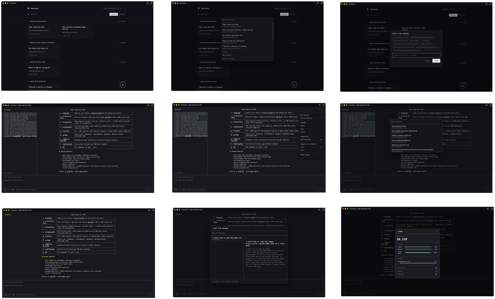
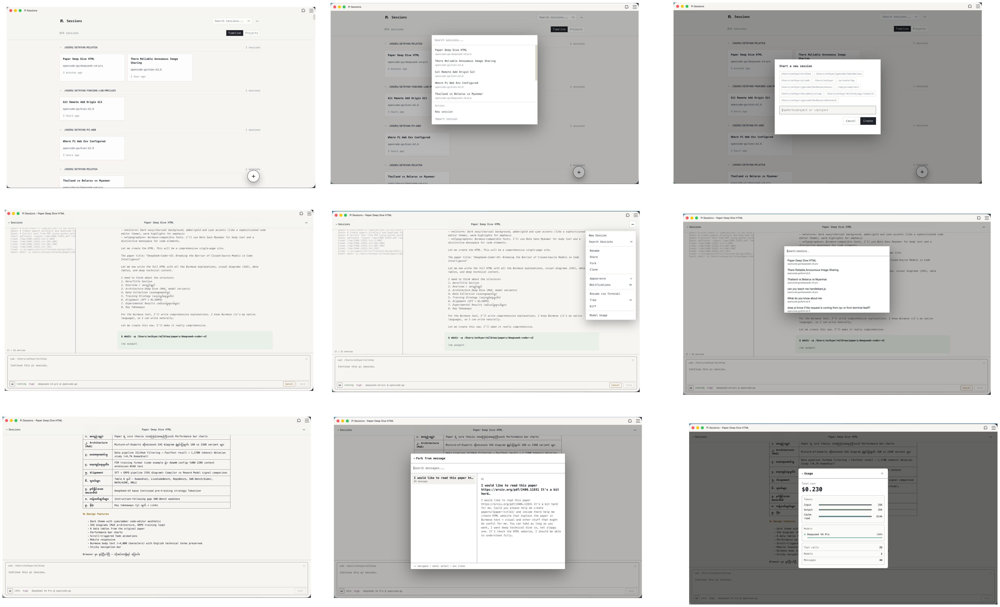
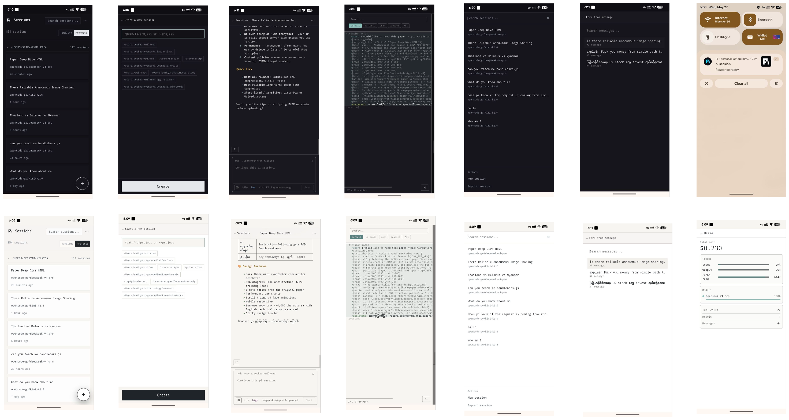

# Welcome to pi-web 🖥️

**Thinking about trying pi-web? Go for it — you'll fall in love.**

pi-web is a beautiful web UI and PWA for [pi](https://pi.dev) — the open-source AI coding agent. It lets you browse, read, and continue your pi sessions from any browser, on any device, with thoughtful features at every turn.

**pi-web is built for two kinds of people:**

- 🧑‍💻 **For developers** — who live in the terminal but want to continue sessions from mobile, hand off to a remote server, or monitor long-running tasks from anywhere.
- ✨ **For non-developers** — who just want a beautiful AI app that works. Open it, type, vibe. No terminal, no SSH, no confusion. Like the most user-friendly AI tools, but with model choice and open-source freedom.

---

## Why pi-web?

You're already deep in the flow with pi in your terminal. pi-web keeps that momentum going when you step away from your desk:

- **Resume from anywhere** — continue a session from your phone, tablet, or another computer. No SSH, no Termius — just open your browser.
- **Multi-session dashboard** — kick off work in one session while watching another stream. Search across projects, filter by branch, find what you need fast.
- **Open-source foundation** — pi is fully open source and provider-agnostic. You're not locked into a single model or vendor. pi-web is open source too.
- **Safe remote access** — built-in token auth so you can expose it on your LAN or Tailscale without worry.
- **Share your work** — export sessions as static snapshots or secret GitHub Gists in one click.

> Curious about the backstory? [Read why we built it →](why.md)

---

## pi-web as a desktop app 🏠

pi-web is a PWA (Progressive Web App). That means you can **install it like a native app** on your desktop, laptop, phone, or tablet — no app store needed.

On desktop, it opens in its own window with no browser chrome. It looks and feels like a real desktop application. This is a game-changer for accessibility:

- **Non-technical people can use it.** Set up pi-web on their machine, show them how to use it once, and they're good to go. Your parents, your partner, your non-tech friends — no terminal, no SSH, just a familiar chat interface.
- **It's like Claude Co-work, but open source.** You own the stack. You pick the model. If you run a local model, your data never leaves your machine.
- **One setup, many users.** Install it on your desktop and share your screen. Or expose it on your home network and let family members open it on their own devices.

> 💡 **Pro tip:** Install pi-web as a PWA from Chrome/Edge (click the install icon in the address bar) or Safari (Share → Add to Dock). It becomes indistinguishable from a native app.

---

## What you can do with pi-web

| | |
|---|---|
| 📱 **PWA** | Install pi-web as a Progressive Web App on desktop, phone, or tablet for a native feel. |
| 🔄 **Continue sessions** | Pick up any conversation right where you left off — text, images, model switching, all from the browser. |
| 🆕 **Start new sessions** | Create fresh sessions against any project path, straight from the web UI. |
| 📡 **Live streaming** | Watch pi responses stream in real time with ~ms latency. Follow mode keeps you locked on the latest. |
| 🌲 **Tree view** | Navigate pi's native message tree — see the full conversation structure, jump to any branch, and fork from any point. |
| 🔀 **Fork sessions** | Fork a session from any message or even a specific tool call — explore different directions without losing your place. |
| 🔍 **Browse & search** | Filter sessions across projects, search by name, navigate branches — your full session history at a glance. |
| 🌿 **Git integration** | See the current branch and open a GitHub PR right from the session viewer. |
| 📝 **Scratchpad** | Jot down notes, todos, or quick thoughts alongside your sessions without switching apps. |
| 💬 **Annotations** | Highlight and comment on any part of a session — great for code review, feedback, or bookmarking key moments. |
| 🎨 **Themes & customization** | Switch between dark and light mode, tweak the UI to your liking — make pi-web feel like *yours*. |
| 🌐 **Multi-language** | 14 built-in languages (English, Español, Français, Deutsch, 中文, 日本語, Bahasa Indonesia, Bahasa Melayu, Tiếng Việt, ไทย, Filipino, မြန်မာ, ភាសាខ្មែរ, ລາວ). Add your own custom language from Settings. |
| 🐱 **Wellness & pomodoro** | Too much vibe coding isn't healthy. Built-in pomodoro timer with a cat companion and sleep reminders to keep you balanced. |
| 📤 **Share & export** | Download JSONL, export static snapshots rendered with pi's native `pi.dev` look, or share as private GitHub Gists — all rendered client-side. |
| 🔔 **Notification sounds** | Customizable notification chimes for session events — stay in the loop even when pi-web is in another tab. |
| ⌨️ **Keyboard shortcuts** | Vim-style navigation, quick actions — [full reference →](keyboard-shortcuts.md) |
| 🤖 **Personal assistant** | Turn pi-web into your own AI assistant that lives on your computer — like OpenClaw or Hermes. [Set it up →](personal-assistant.md) |

---

## Quick navigation

| If you're looking for… | Read |
|---|---|
| How to install, configure, and use pi-web | [install.md](install.md) |
| Use pi-web as a personal assistant | [personal-assistant.md](personal-assistant.md) |
| Keyboard shortcuts reference | [keyboard-shortcuts.md](keyboard-shortcuts.md) |
| Why pi-web exists | [why.md](why.md) |
| What's coming next | [roadmap.md](roadmap.md) |
| Having install trouble? Let your LLM fix it — paste the llm-debug.md link to them | [llm-debug.md](llm-debug.md) |

---

## Screenshots

| Desktop — dark mode | Desktop — light mode | Mobile PWA |
|---|---|---|
|  |  |  |

---

## 💛 Sponsor

pi-web is built with love and a lot of late nights. I pay for coding plans (Claude Code, OpenCode, etc.) out of pocket to keep this project moving forward. If pi-web has been useful to you, your support would mean the world.

**Ways to help:**

- 💰 **[Sponsor on GitHub](https://github.com/sponsors/setkyar)** — help cover the tools that make this possible
- ☕ **[Buy me a coffee](https://buymeacoffee.com/setkyar)** — every little bit helps
- ⭐ **Star the repo** — it costs nothing and helps more people discover pi-web
- 📢 **Share with friends & family** — if you know someone who'd love pi-web, send it their way

Can't sponsor? No worries at all — a star and a share go a long way. Thank you for being here. 🙏

---

Happy coding! 🚀
